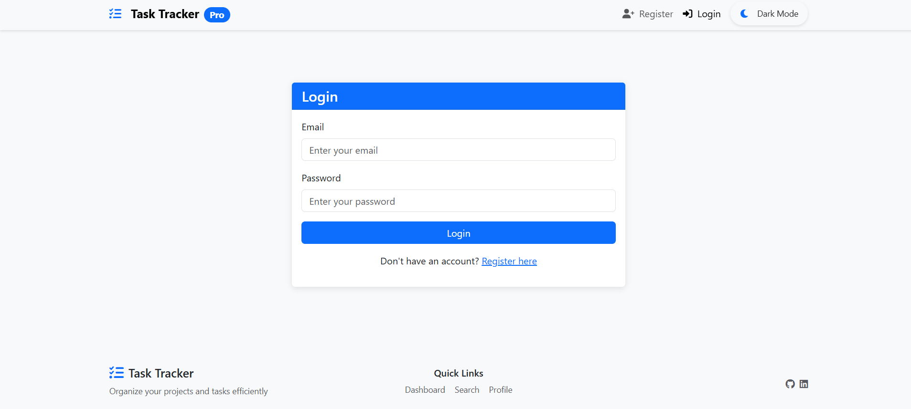
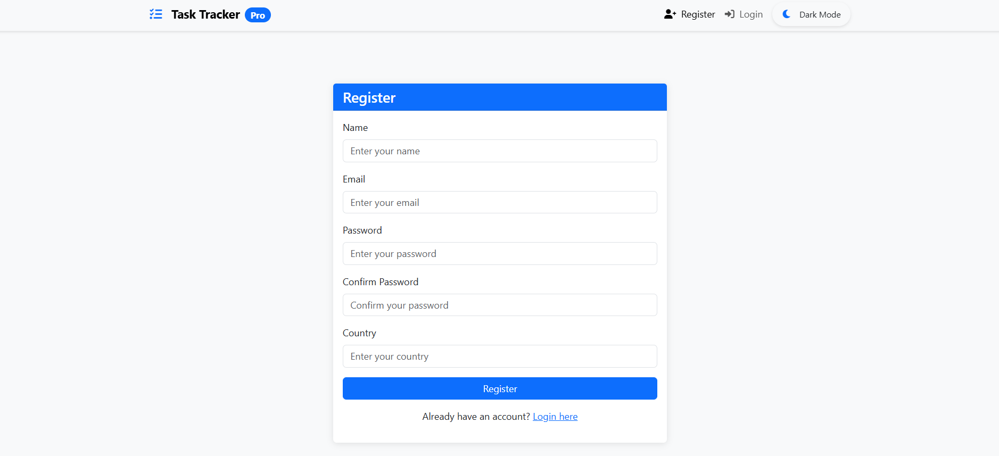
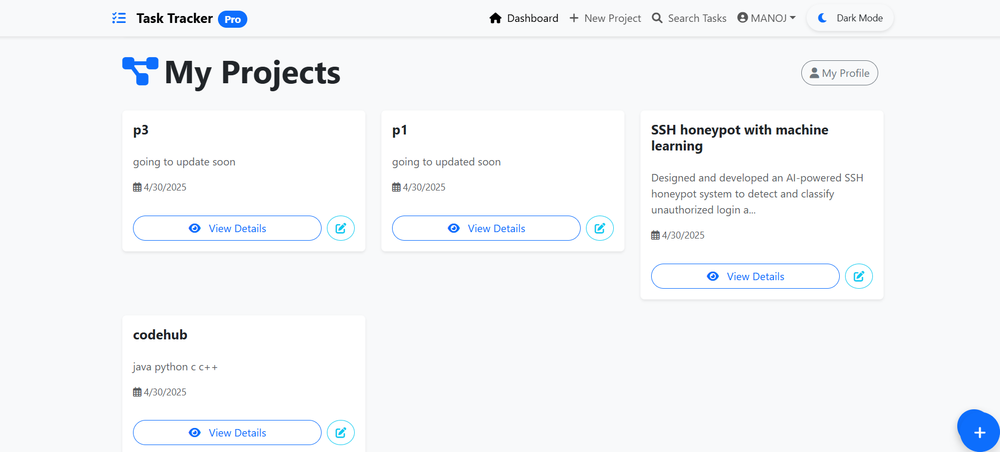
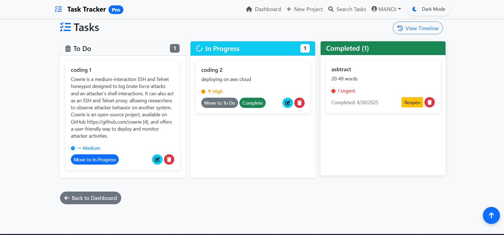

# TaskMaster Pro: Advanced Project & Task Management System

  

A modern, feature-rich full-stack application for efficient project and task management with a beautiful UI and smooth animations. TaskMaster Pro helps teams and individuals organize their work with an intuitive, responsive interface.









## ✨ Features

### 🔐 User Authentication & Authorization
- Secure signup and login with JWT authentication
- Password encryption and secure storage
- Protected routes for authenticated users
- User profile management

### 📊 Project Management
- Create, read, update, and delete projects
- Project details with description and creation date
- Project statistics and progress tracking
- Export project data to CSV

### ✅ Task Management
- Create, read, update, and delete tasks within projects
- Drag-and-drop task organization
- Task status tracking (todo, in-progress, completed)
- Task priority levels (low, medium, high, urgent)
- Due date assignment and tracking

### 🎨 Modern UI/UX
- Responsive design for all devices
- Dark/light mode toggle
- Smooth animations and transitions
- Interactive dashboard with project statistics
- Real-time notifications

### 🔍 Search & Filter
- Advanced search functionality for tasks
- Filter tasks by status, priority, and due date
- Sort projects and tasks by various criteria

## 🛠️ Tech Stack

### Backend
- **Node.js** - JavaScript runtime
- **Express.js** - Web framework
- **MongoDB** - NoSQL database
- **Mongoose** - MongoDB object modeling
- **JWT** - Authentication
- **Bcrypt** - Password hashing

### Frontend
- **React.js** - UI library
- **React Router** - Navigation
- **React Bootstrap** - UI components
- **Framer Motion** - Animations
- **Axios** - HTTP client
- **Context API** - State management

## 🚀 Setup and Installation Guide

### Prerequisites

- Node.js (v14.0.0 or higher)
- npm (v6.0.0 or higher)
- MongoDB (local installation or MongoDB Atlas account)
- Git

### Clone the Repository

```bash
# Clone the repository
git clone https://github.com/yourusername/taskmaster-pro.git

# Navigate to the project directory
cd taskmaster-pro
```

### Backend Setup

1. Navigate to the backend directory:
   ```bash
   cd backend
   ```

2. Install dependencies:
   ```bash
   npm install
   ```

3. Create a `.env` file in the backend directory with the following variables:
   ```
   PORT=5000
   MONGO_URI=your_mongodb_connection_string
   JWT_SECRET=your_jwt_secret
   JWT_EXPIRE=30d
   ```

4. Start the backend server:
   ```bash
   npm start
   ```
   For development with auto-reload:
   ```bash
   npm run dev
   ```

### Frontend Setup

1. Open a new terminal and navigate to the frontend directory:
   ```bash
   cd frontend
   ```

2. Install dependencies:
   ```bash
   npm install
   ```

3. Start the frontend development server:
   ```bash
   npm start
   ```

4. The application will open in your default browser at `http://localhost:3000`

## 📱 Usage Guide

### Registration and Login

1. Navigate to the registration page by clicking "Register" in the navigation bar
2. Fill in your details and create an account
3. Log in with your credentials

### Creating a Project

1. From the dashboard, click "Add Project"
2. Fill in the project title and description
3. Click "Create Project"

### Managing Tasks

1. Click on a project to view its details
2. Click "Add Task" to create a new task
3. Fill in the task details including title, description, status, priority, and due date
4. Use the task controls to change status, edit, or delete tasks

### Editing Projects and Tasks

1. For projects:
   - Click the "Edit Project" button on the project details page
   - Or use the edit icon on the dashboard project cards
   - Update the project details and save

2. For tasks:
   - Click the edit icon on any task card
   - Update the task details and save

### Searching Tasks

1. Navigate to the Search page from the navigation bar
2. Enter your search query
3. View and interact with the search results

### Exporting Data

1. From the project details page, click "Export Tasks"
2. A CSV file will be downloaded with all task data

### Theme Toggle

1. Click the theme toggle button in the navigation bar to switch between light and dark modes

## 🔌 API Endpoints

### Authentication
- `POST /api/auth/register` - Register a new user
- `POST /api/auth/login` - Login a user
- `GET /api/auth/me` - Get current user profile

### Projects
- `GET /api/projects` - Get all projects for the logged-in user
- `POST /api/projects` - Create a new project
- `GET /api/projects/:id` - Get a single project by ID
- `PATCH /api/projects/:id` - Update a project
- `DELETE /api/projects/:id` - Delete a project

### Tasks
- `POST /api/tasks` - Create a new task
- `GET /api/tasks/project/:projectId` - Get all tasks for a specific project
- `GET /api/tasks/search` - Search tasks by title or description
- `GET /api/tasks/export/csv` - Export tasks as CSV
- `GET /api/tasks/:id` - Get a single task by ID
- `PATCH /api/tasks/:id` - Update a task
- `DELETE /api/tasks/:id` - Delete a task

## 🧪 Testing

### Backend Tests

```bash
cd backend
npm test
```

### Frontend Tests

```bash
cd frontend
npm test
```

## 🤝 Contributing

Contributions are welcome! Please feel free to submit a Pull Request.

1. Fork the repository
2. Create your feature branch (`git checkout -b feature/amazing-feature`)
3. Commit your changes (`git commit -m 'Add some amazing feature'`)
4. Push to the branch (`git push origin feature/amazing-feature`)
5. Open a Pull Request

## 📄 License

This project is licensed under the MIT License - see the LICENSE file for details.

## 📞 Contact

Your Name - mk458557@gmail.com

Project Link: [https://github.com/kingslayer458/taskmaster-pro](https://github.com/kingslayer458/TasktrackerPro)

## 🙏 Acknowledgements

- [React.js](https://reactjs.org/)
- [Node.js](https://nodejs.org/)
- [MongoDB](https://www.mongodb.com/)
- [Express.js](https://expressjs.com/)
- [Bootstrap](https://getbootstrap.com/)
- [Font Awesome](https://fontawesome.com/)
- [Framer Motion](https://www.framer.com/motion/)
