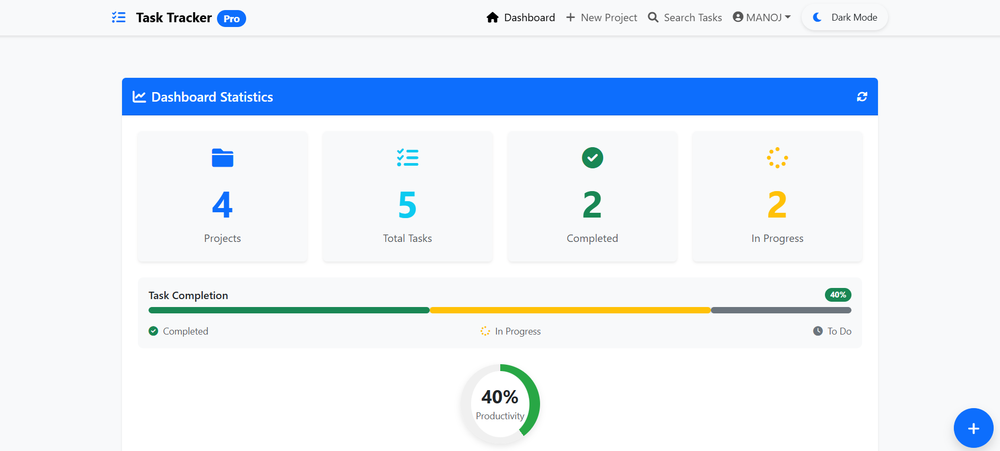
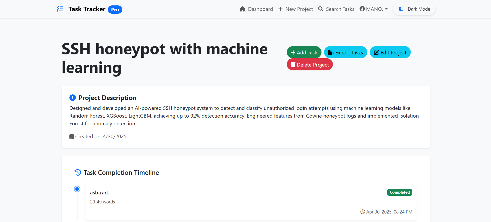
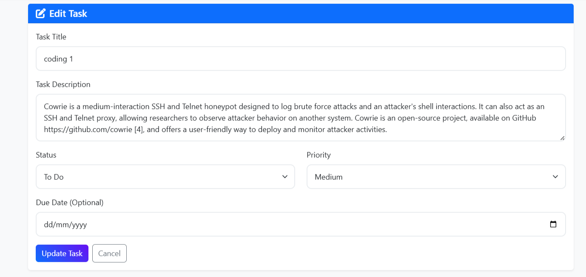
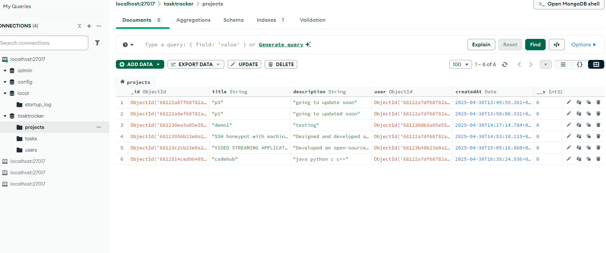

# TaskMaster Pro: Advanced Project & Task Management System

  

A modern, feature-rich full-stack application for efficient project and task management with a beautiful UI and smooth animations. TaskMaster Pro helps teams and individuals organize their work with an intuitive, responsive interface.


📺 **Live Demo**: [https://taskmasterpro.onrender.com](https://tasktracker-for-railway-1.onrender.com/)

>  **Cloud Deployment Details**
> - **Frontend**: Render  
> - **Backend Server**: Render  
> - **Database (MongoDB)**: Railway app
## Sreenshots










## ✨ Features

###  User Authentication & Authorization
- Secure signup and login with JWT authentication and check .env file 
- Password encryption and secure storage
- Protected routes for authenticated users
- User profile management

###  Project Management
- Create, read, update, and delete projects
- Project details with description and creation date
- Project statistics and progress tracking
- Export project data to CSV

###  Task Management
- Create, read, update, and delete tasks within projects
- Task status tracking (todo, in-progress, completed)
- Task priority levels (low, medium, high, urgent)
- Due date assignment and tracking


##  Tech Stack

### Backend
- **Node.js** - JavaScript runtime
- **Express.js** - Web framework
- **MongoDB** - NoSQL database
- **Mongoose** - MongoDB object modeling
- **JWT** - Authentication
- **Bcrypt** - Password hashing

### Frontend
- **React.js** - UI library
- **React Router** - Navigation
- **React Bootstrap** - UI components
- **Framer Motion** - Animations
- **Axios** - HTTP client
- **Context API** - State management

## Setup and Installation Guide

### Prerequisites

- Node.js (v14.0.0 or higher)
- npm (v6.0.0 or higher)
- MongoDB (local installation or MongoDB Atlas account)
- Git

### Clone the Repository

```bash
# Clone the repository
https://github.com/kingslayer458/TasktrackerPro.git
```

### Backend Setup

1. Navigate to the backend directory:
   ```bash
   cd backend
   ```

2. Install dependencies:
   ```bash
   npm install
   ```

3. Create a `.env` file in the backend directory with the following variables:
   ```
   PORT=5000
   MONGO_URI=your_mongodb_connection_string
   JWT_SECRET=your_jwt_secret
   JWT_EXPIRE=30d
   ```

4. Start the backend server:
   ```bash
   npm run dev
   ```

### Frontend Setup

1. Open a new terminal and navigate to the frontend directory:
   ```bash
   cd frontend
   ```

2. Install dependencies:
   ```bash
   npm install
   ```

3. Start the frontend development server:
   ```bash
   npm start
   ```

4. The application will open in your default browser at `http://localhost:3000`

##  API Endpoints

### Authentication
- `POST /api/auth/register` - Register a new user
- `POST /api/auth/login` - Login a user
- `GET /api/auth/me` - Get current user profile

### Projects
- `GET /api/projects` - Get all projects for the logged-in user
- `POST /api/projects` - Create a new project
- `GET /api/projects/:id` - Get a single project by ID
- `PATCH /api/projects/:id` - Update a project
- `DELETE /api/projects/:id` - Delete a project

### Tasks
- `POST /api/tasks` - Create a new task
- `GET /api/tasks/project/:projectId` - Get all tasks for a specific project
- `GET /api/tasks/search` - Search tasks by title or description
- `GET /api/tasks/export/csv` - Export tasks as CSV
- `GET /api/tasks/:id` - Get a single task by ID
- `PATCH /api/tasks/:id` - Update a task
- `DELETE /api/tasks/:id` - Delete a task

Project Link: [https://github.com/kingslayer458/taskmaster-pro](https://github.com/kingslayer458/TasktrackerPro)


